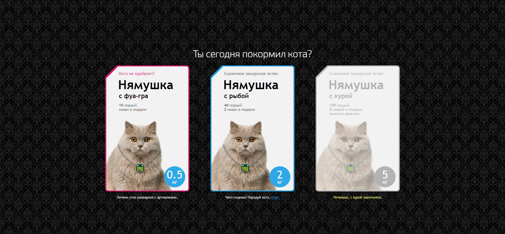

## Тестовое квалификационное задание от funbox
Тестовое задание для компании `funBox` 
[DEMO](https://webbomj.github.io/funbox-test-work/) 

## Возможности
Плашки с котиками имеют 3 состояния: не выбрано(синий), выбрано(красный), отсутствует на складе(серый). 
При выборе котика меняется статус на выбрано(красный). При выбранном состоянии и когда мышка покинула блок, меняется текст наверху блока (только 1 раз).

## Использовались иструменты:
1.Typescript
2.React (hooks)
3.gh-pages
4.prettier
5.VScode
